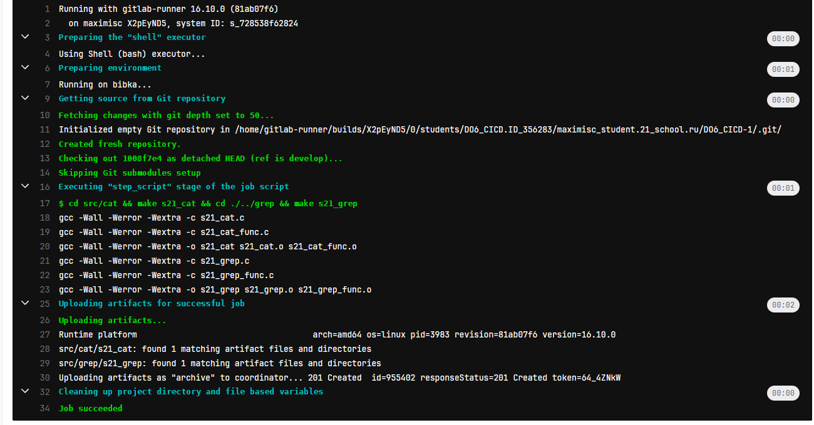

# Basic CI/CD

Разработка простого **CI/CD** для проекта *SimpleBashUtils*. Сборка, тестирование, развертывание.

## Contents

1. [Chapter I](#chapter-i) \
   1.1. [Настройка gitlab-runner](#part-1-настройка-gitlab-runner) \
   1.2. [Сборка](#part-2-сборка) \
   1.3. [Тест кодстайла](#part-3-тест-кодстайла) \
   1.4. [Интеграционные тесты](#part-4-интеграционные-тесты)

## Part 1. Настройка gitlab-runner

- Проверка весрии linux \

- Скачиваем gitlub-runner \

- Устанавливаем и запускаем \

- Проверяем статус выполнения \

- Регистрируем gitlab-runner \

## Part 2. Сборка

- Добовляем этап запуска сборки в `.gitlab-ci.yml` \

- Проверка сборки \

- Проверка создания артефакта \

## Part 3. Тест кодстайла

- Дописываем `.gitlab-ci.yml` для стиля \

- Проверяем пропустит ли ошибку \

- Исправляем ошибку и пушим \

## Part 4. Интеграционные тесты

- Дописываем `.gitlab-ci.yml` для интеграции тестов \

- Проверка тестов \

## Part 5. Развертывание

- Настраиваем netplan на виртуальных машинах \

- Проверка что они видят друг друга

- 